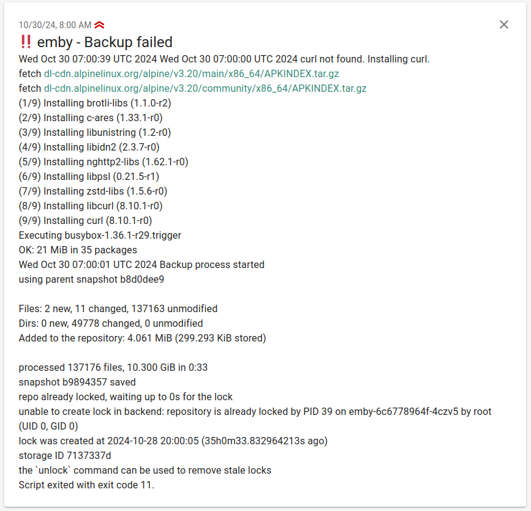

# Backup

For backups I need a solution that backups the files within a persistend volume.
I've taken a look at velero and the included backup solution from Longhorn but wasn't able
to get what I want. Longhorn seems to be doing block based backups and with Velero I wasn't able to create file backups. Althoug I do not exclude that I've missed something.

At the moment I'm evaluating restic as a sidecar container. The sidecar container uses crontab to create backups in regular intervals. The container mounts the crontab config and backup script from configmaps and reads the environment variables from a secret, which configure the backup.

Backups with restic provide:

- ✅ ... encryption
- ✅ ... compression
- ✅ ... deduplication
- ✅ ... retention policies

So I can upload my backup to any storage backend without leaking any data. And because of deduplication and compression a lot of storage space can be saved. Included retention policies make it easy to delete old backups.

Script Features:

- Backup any folder to a restic supported storage backend
- Delete old backups (Daily, Weekly, Monthly, Always Keep Last)
- ntfy.sh notification on failure
- prometheus pushgateway metrics

/// info
The script runs restic and uploads the backup to the storage backend. Additionally it deletes old backups. It get's the configuration from environment variables.
///

```yaml title="Sidecar deployment example"
apiVersion: apps/v1
kind: Deployment
spec:
  template:
    spec:
      containers:
        - name: backup-sidecar
          image: ghcr.io/restic/restic:0.17.1
          envFrom:
            - secretRef:
                name: backup-env-configuration
          imagePullPolicy: IfNotPresent
          command: ["/usr/sbin/crond", "-f", "-d", "6"]
          volumeMounts:
            - mountPath: /backup/config
              name: config
              readOnly: true
            - name: crontab-config
              mountPath: /etc/crontabs/root
              subPath: crontab
            - name: backup-script
              mountPath: /usr/local/bin/backup.sh
              subPath: backup.sh
      volumes:
        - name: crontab-config
          configMap:
            name: crontab
        - name: backup-script
          configMap:
            name: crontab-backup-script
```

```yaml title="crontab configuration"
apiVersion: v1
kind: ConfigMap
metadata:
  name: crontab
data:
  crontab: |
    # m h  dom mon dow   command
    # Run script every hour
    0 * * * * /bin/sh /usr/local/bin/backup.sh
```

```yaml title="restic configuration"
apiVersion: v1
kind: Secret
metadata:
  name: backup-env-configuration
stringData:
  # Source directory to backup
  RESTIC_SOURCE: /backup/config
  # Backup repository (destination)
  RESTIC_REPOSITORY: s3:s3.eu-central-2.wasabisys.com/path/to/backup
  # Backup password
  RESTIC_PASSWORD: <BackupPassword>
  # Retention policies
  KEEP_HOURLY: "48"
  KEEP_DAILY: "7"
  KEEP_WEEKLY: "4"
  KEEP_LAST: "1"
  # AWS credentials
  AWS_ACCESS_KEY_ID: <SecureSuperSecretKey>
  AWS_SECRET_ACCESS_KEY: <VerySecureSuperSecretKey>
```

I won't include the backup script here, because it can change over time. The script is available in [my git repository](https://github.com/Madic-/k3s-git-ops/blob/main/apps/backup-script/backup-script.yaml){target=_blank} as a ConfigMap. The ConfigMap get's replicated via reflector to all namespaces so all deployments can use the same script. But after changes to the script the pods using the script need to be restarted. This can be done by deleting the pods or by rolling out a new deployment.

## Notifications

To get notified if a backup fails I'm using [ntfy](https://ntfy.sh/){target=_blank}. Ntfy is a simple notification service that can be self-hosted.

[{: style="height:600px" loading=lazy}](images/ntfy_backup_alert.png)

### Pushgateway Integration

Additionaly the backup script supports integration with a Prometheus Pushgateway to send custom metrics about the backup process. This enables tracking of backup duration, start time, and status.

#### Configuration

To enable metrics pushing to the Pushgateway, the following environment variables should be configured:

- **`PUSHGATEWAY_ENABLED`**: Set this to `"true"` to enable sending metrics to the Pushgateway
- **`PUSHGATEWAY_URL`**: Specify the URL of the Pushgateway server where metrics should be sent to

#### Metrics Published

/// warning
The metrics might change in the future. Currently I'm not realy satisfied. But maybe that's because I wasn't able to create a good grafana dashboard with them yet. I would appreciate any help. See issue [#3](https://github.com/Madic-/k3s-git-ops/issues/3){target=_blank}
///

The script publishes the following metrics to the Pushgateway:

- **`backup_duration_seconds`**: The time, in seconds, that the backup process took
- **`backup_start_timestamp`**: The timestamp in epoch at which the backup process began
- **`backup_status`**: The status of the backup process, with either `status="success"` or `status="failure"`

**Example Environment Configuration:**

```yaml
PUSHGATEWAY_ENABLED: "true"
PUSHGATEWAY_URL: http://pushgateway.monitoring.svc.cluster.local
```

## 📝 Environment Variables

The following environment variables are used to configure the backup script.

| <div style="width:180px">Environment Variable</div>    | Description                                                                                    |
|-------------------------|------------------------------------------------------------------------------------------------|
| `RESTIC_SOURCE`         | Source directory to back up using Restic                                                       |
| `RESTIC_REPOSITORY`     | Destination repository for the backup                                                          |
| `RESTIC_PASSWORD`       | Password for encrypting the backup                                                             |
| `RESTIC_HOSTNAME`       | **Optional.** Hostname to use for the backup. Defaults to `$(hostname | cut -d '-' -f1)`, which gives the pod name. Especially usefull for pods with host networking. |
| `AWS_ACCESS_KEY_ID`     | Access key ID for authenticating with an S3 compatible storage backend                         |
| `AWS_SECRET_ACCESS_KEY` | Secret access key for authenticating with an S3 compatible storage backend                     |
| `KEEP_HOURLY`           | Number of hourly backups to retain                                                             |
| `KEEP_DAILY`            | Number of daily backups to keep                                                                |
| `KEEP_WEEKLY`           | Number of weekly backups to maintain                                                           |
| `KEEP_LAST`             | Total number of most recent backups to keep, irrespective of time-based intervals              |
| `NTFY_ENABLED`          | **Optional.** Indicates whether notification via ntfy is enabled. Possible values are `"true"` or `"false"`  |
| `NTFY_TITLE`            | Title of the ntfy notification message. Can be a string or shell command                       |
| `NTFY_CREDS`            | **Optional.** Credentials for authenticating with the ntfy notification service.                |
| `NTFY_PRIO`             | Priority level for the ntfy notification. Determines the importance of the notification        |
| `NTFY_TAG`              | Tags to categorize the ntfy notification, allowing filtering or grouping of messages           |
| `NTFY_SERVER`           | URL of the ntfy server used for sending notifications                                          |
| `NTFY_TOPIC`            | Specific topic on the ntfy server where the message will be sent.                              |
| `PUSHGATEWAY_ENABLED`   | **Optional.** Indicates whether sending metrics to the Pushgateway is enabled. Possible values are `"true"` or `"false"` |
| `PUSHGATEWAY_URL`       | URL of the Pushgateway server for sending metrics                                              |

```yaml title="Example environment variables"
RESTIC_SOURCE: /backup/config
RESTIC_REPOSITORY: s3:s3.eu-central-2.wasabisys.com/k3s-at-home-01/emby
RESTIC_PASSWORD: bDuSsDS7uWf0OGrK4y5SBvEfIKkIVcK3gGZpxsVx6Ya6PfwkWANDZo8mRaoGnCE6
KEEP_HOURLY: "48"
KEEP_DAILY: "7"
KEEP_WEEKLY: "4"
KEEP_LAST: "1"
AWS_ACCESS_KEY_ID: v1eoAeRYfHhcRsUsW
AWS_SECRET_ACCESS_KEY: Hlk6wZiKdrqIafYLOdMbw9Z7WfKK8W6ata
NTFY_ENABLED: "true"
NTFY_TITLE: $(hostname | cut -d '-' -f1) - Backup failed
# Needs to be with "-u"
NTFY_CREDS: -u mne-adm:qhCVXJvzkf9SkjgFE9RDhtzycKbszdSnVw7fHFgS3cZCDmZMno25yfVhikrnPidS
NTFY_PRIO: "4"
NTFY_TAG: bangbang
NTFY_SERVER: https://ntfy.geekbundle.org
NTFY_TOPIC: kubernetes-at-home
PUSHGATEWAY_ENABLED: "true"
PUSHGATEWAY_URL: http://pushgateway.monitoring.svc.cluster.local
```

## rclone

At some point I was also evaluating [rclone](https://rclone.org){target=_blank} as a sidecar container. But it doesn't support de-duplication and I want my storage costs to be as low as possible. For history reasons I keep the script that I've written and mounted in the container.

```shell title="rclone-backup.sh"
#!/bin/sh

# Create run.log only if it does not exist
if [ ! -f /data/run.log ]; then
  touch /data/run.log
fi

# Echo current date to run.log for logging purposes
echo "$(date) Backup process started" >> /data/run.log

# Sync source to destination with a backup directory using 'year-month-day' format
backup_dir="$BUP_DST/$(hostname | cut -d '-' -f1)-$(date +%Y-%m-%d)"
rclone --config /config/rclone/rclone.conf sync "$BUP_SRC" "$BUP_DST/$(hostname | cut -d '-' -f 1)" -v --backup-dir="$backup_dir"

# Calculate the date for retention time
RETENTION_DATE=$(date -d '7 days ago' +%Y-%m-%d)

# List directories and delete those older than retention time
rclone --config /config/rclone/rclone.conf lsf "$BUP_DST/" --dirs-only | while read dir; do
  # Extract the date from the directory name
  dir_date=$(echo "$dir" | awk -F'-' '{print $NF}' | sed 's#/##g')
  # Compare directory date with RETENTION_DATE
  if [ "$dir_date" \< "$RETENTION_DATE" ]; then
    echo "Deleting old backup directory: $BUP_DST/$dir" >> /data/run.log
    rclone --config /config/rclone/rclone.conf purge "$BUP_DST/$dir"
  fi
done

# Log the completion of the backup process
echo "$(date) Backup process completed" >> /data/run.log
```
This required the following config map mounted to /config/rclone/rclone.conf

```yaml title="rclone configuration"
---
apiVersion: v1
kind: Secret
metadata:
  name: rclone-config
  namespace: whoami
stringData:
  rclone.conf: |
    [WasabiFrankfurt]
    type = s3
    provider = Wasabi
    env_auth = false
    access_key_id = <SuperSecretImportantPrivy>
    secret_access_key = <VeryVerySuperSecretImportantPrivy>
    region = eu-central-2
    endpoint = s3.eu-central-2.wasabisys.com
    acl =
```
