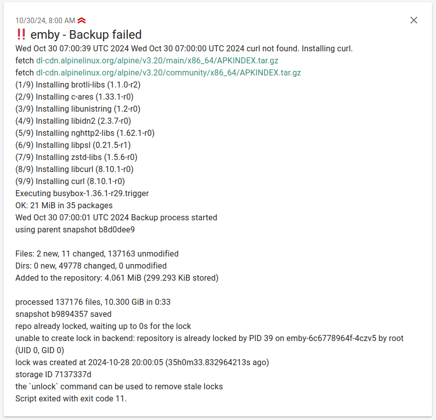

# Backup

The cluster needs a backup solution that captures the contents of persistent
volumes. Velero and Longhorn's built-in backup were both evaluated and ruled out:
Longhorn does block-level backups, and Velero did not produce file-level snapshots
in the way I wanted (admittedly I may have missed something).

The current setup uses [restic](https://restic.net/){target=_blank}, a single
shared backup script, and a fleet of standalone CronJobs. Each target has its own
CronJob, but all of them share one repository, one password, and one retention pass.

restic provides everything I want from a backup tool:

- ✅ ... encryption
- ✅ ... compression
- ✅ ... deduplication
- ✅ ... retention policies

The shared script (`backup.sh`) is small and config-driven via environment
variables. It runs `restic backup`, optionally pushes Pushgateway metrics, and
optionally sends a ntfy notification on failure.

## Architecture

```
┌──────────────────────┐  ┌──────────────────────┐  ┌── more backup CronJobs
│ backup-mariadb       │  │ backup-emby          │  │
│   (databases ns)     │  │   (media ns)         │
│ initContainer dumps  │  │ podAffinity:emby     │
│ → restic backup ─────┼┐ │ → restic backup ─────┼──┤
└──────────────────────┘│ └──────────────────────┘  │
                        │                            │
                        │   ┌─────────────────────┐  │
                        │   │ backup.sh (shared)  │  │
                        │   │ ConfigMap mirrored  │  │
                        │   │ via Reflector       │  │
                        │   └─────────────────────┘  │
                        │                            │
                        ▼                            ▼
        ┌──────────────────────────────────────────────────┐
        │ Wasabi S3: k3s-at-home-01/restic-backup          │
        │   one repository, multiple tags                  │
        └────────────┬─────────────────────────────────────┘
                     │
                     ▼
        ┌──────────────────────────────────────────────────┐
        │ restic-retentionpolicies (longhorn ns)           │
        │   daily forget + prune                           │
        └──────────────────────────────────────────────────┘
                     │
   metrics ──────────┴────────── ntfy
        ▼                            ▼
  Pushgateway                  ntfy.geekbundle
```

The shared script lives as ConfigMap `crontab-backup-script` in the `longhorn`
namespace and is mirrored into every namespace by
[Reflector](https://github.com/emberstack/kubernetes-reflector){target=_blank},
so every backup CronJob mounts it from its own namespace.

The script source is in the
[git repository](https://github.com/madic-creates/k3s-git-ops/blob/main/apps/backup-script/backup-script.yaml){target=_blank}.
Pods using the script need to be restarted after script changes (delete the pod
or roll the deployment).

## Backup fleet

| Target | Namespace | Schedule | Tag | Hostname | Source |
|---|---|---|---|---|---|
| MariaDB | `databases` | `:10` hourly (skip 02-03) | `mariadb` | `mariadb` | `kubectl exec` dump → `/backup/mariadb.xb` |
| Grafana | `monitoring` | `:20` hourly | `grafana` | `grafana` | PVC `longhorn-pvc-grafana` |
| Emby | `media` | `:30` hourly | `emby` | `emby` | PVC `longhorn-pvc-emby` |
| NextPVR | `media` | `:40` hourly | `nextpvr` | `nextpvr` | PVC `longhorn-pvc-nextpvr-config` |
| Downloader (*arr-stack) | `downloader` | `:50` hourly | `downloader` | `downloader` | hostPath, ZFS node |
| Paperless-ngx | `paper` | `:00` hourly | `paperless` | `paperless` | 3 SMB PVCs (data, media, export) |
| Retention | `longhorn` | `03:05` daily | n/a | `restic-retentionpolicies` | (forget + prune only) |

Hourly slots are 10 minutes apart and each backup is capped at
`activeDeadlineSeconds: 540`, so they cannot overlap with each other or with the
daily retention pass at 03:05.

The pod `app.kubernetes.io/name` label is always `backup-<target>` (e.g.
`backup-grafana`) and pods carry `app.kubernetes.io/component: backup` so the
Pushgateway NetworkPolicy can match by component.

## CronJob skeleton

Below is the Grafana CronJob, simplified. All non-mariadb backups follow the
same pattern (PVC mounted at `/backup/<target>`, podAffinity to the app pod
when the PVC is RWO):

```yaml title="apps/monitoring/k8s.backup-grafana-cronjob.yaml"
apiVersion: batch/v1
kind: CronJob
metadata:
  name: backup-grafana
  namespace: monitoring
spec:
  schedule: "20 * * * *"
  concurrencyPolicy: Forbid
  failedJobsHistoryLimit: 1
  successfulJobsHistoryLimit: 1
  startingDeadlineSeconds: 3600
  jobTemplate:
    spec:
      backoffLimit: 2
      activeDeadlineSeconds: 540
      template:
        metadata:
          labels:
            app.kubernetes.io/name: backup-grafana
            app.kubernetes.io/component: backup
        spec:
          automountServiceAccountToken: false
          restartPolicy: Never
          securityContext:
            runAsUser: 472
            runAsGroup: 472
            fsGroup: 472
            runAsNonRoot: true
          affinity:
            podAffinity:
              requiredDuringSchedulingIgnoredDuringExecution:
                - labelSelector:
                    matchLabels:
                      app.kubernetes.io/name: grafana
                  namespaces: [monitoring]
                  topologyKey: kubernetes.io/hostname
          containers:
            - name: restic
              image: ghcr.io/madic-creates/container-restic:latest
              command: ["/bin/sh", "/usr/local/bin/backup.sh"]
              env:
                - name: HOME
                  value: /home/restic
              envFrom:
                - secretRef: { name: backup-env-configuration-grafana }
              volumeMounts:
                - name: backup-script
                  mountPath: /usr/local/bin/backup.sh
                  subPath: backup.sh
                - name: grafana
                  mountPath: /backup/grafana
                  readOnly: true
                - name: home
                  mountPath: /home/restic
          volumes:
            - name: grafana
              persistentVolumeClaim: { claimName: longhorn-pvc-grafana }
            - name: backup-script
              configMap: { name: crontab-backup-script }
            - name: home
              emptyDir: { medium: Memory, sizeLimit: 200Mi }
```

The matching encrypted Secret holds `RESTIC_REPOSITORY`, `RESTIC_PASSWORD`, the
Wasabi credentials, the ntfy and Pushgateway settings, and the per-target
`RESTIC_HOSTNAME` / `RESTIC_ADDITIONAL_BACKUP_PARAMETERS`. See the
[restic configuration example](#restic-configuration-example) below.

## Restore

All snapshots are encrypted and stored in
`s3:s3.eu-central-2.wasabisys.com/k3s-at-home-01/restic-backup`. Listing requires
the repository password; restoring also requires the Wasabi credentials.

### Generic workflow

The simplest way to get a shell with restic, the Wasabi credentials, and the
in-memory cache already wired up is to spawn a one-shot debug pod from the
existing backup secret of the target you want to restore from:

```bash
kubectl run restic-shell -n monitoring --rm -it --restart=Never \
  --image=ghcr.io/madic-creates/container-restic:latest \
  --overrides='{
    "spec": {
      "containers": [{
        "name": "restic-shell",
        "image": "ghcr.io/madic-creates/container-restic:latest",
        "command": ["sh"],
        "stdin": true, "tty": true,
        "envFrom": [{"secretRef": {"name": "backup-env-configuration-grafana"}}]
      }]
    }
  }' -- sh

# Inside the pod
restic snapshots --tag grafana
restic restore latest --tag grafana --target /tmp/restore
ls /tmp/restore/backup/grafana/
```

Pick the namespace and Secret name that matches the target you want to restore.
Replace `--tag grafana` accordingly.

### MariaDB

The MariaDB backup is a `mariabackup --stream=xbstream` dump, restic-archived as
`/backup/mariadb.xb`. Restore the stream, extract it, prepare the data
directory, then either swap it into the live MariaDB or import the tables.

```bash
# In a debug pod with restic and mariadb-backup tools
restic restore latest --tag mariadb --target /tmp/restore
mkdir /tmp/extracted
mbstream -x -C /tmp/extracted < /tmp/restore/backup/mariadb.xb
mariabackup --prepare --target-dir=/tmp/extracted

# Verify table counts (example)
mysql -e "SELECT TABLE_SCHEMA, TABLE_NAME, TABLE_ROWS \
          FROM information_schema.TABLES \
          WHERE TABLE_SCHEMA NOT IN ('information_schema','performance_schema','mysql');"
```

### Emby / NextPVR

```bash
restic restore latest --tag emby --target /tmp/emby-restore
ls /tmp/emby-restore/backup/emby-config/
# Look for system.xml, config files, and the metadata directory.

restic restore latest --tag nextpvr --target /tmp/nextpvr-restore
ls /tmp/nextpvr-restore/backup/nextpvr-config/
```

### Downloader (Sonarr / Radarr / Lidarr / NZBGet / NZBHydra2 / Trailarr)

The downloader snapshot contains all six app config trees in a single tag. Pick
the subfolder you need.

```bash
restic restore latest --tag downloader --target /tmp/restore-test

# SQLite integrity check (example for Sonarr)
sqlite3 /tmp/restore-test/backup/sonarr/sonarr.db "PRAGMA integrity_check;"
sqlite3 /tmp/restore-test/backup/radarr/radarr.db "PRAGMA integrity_check;"
sqlite3 /tmp/restore-test/backup/lidarr/lidarr.db "PRAGMA integrity_check;"
```

`-wal` and `-shm` files travel with the database file in the snapshot if they
existed at backup time — make sure to restore them alongside the `.db`.

### Paperless-ngx

Three top-level paths come back: `paperless-data` (Postgres-style metadata,
SQLite cache, etc.), `paperless-media` (the document archive itself), and
`paperless-export`.

```bash
restic restore latest --tag paperless --target /tmp/paperless-restore
ls /tmp/paperless-restore/backup/paperless-data/
ls /tmp/paperless-restore/backup/paperless-media/documents/originals/
sqlite3 /tmp/paperless-restore/backup/paperless-data/db.sqlite3 "PRAGMA integrity_check;"
```

### Grafana

```bash
restic restore latest --tag grafana --target /tmp/grafana-restore
sqlite3 /tmp/grafana-restore/backup/grafana/grafana.db "PRAGMA integrity_check;"
```

`lost+found` at the PVC root is excluded by the backup; everything else (plugin
data, dashboards from sidecar provisioning that have local edits, etc.) is in
the snapshot.

## Notifications

If a backup fails the script sends a [ntfy](https://ntfy.sh/){target=_blank}
notification. ntfy is a simple notification service that can be self-hosted.

[{: style="height:600px" loading=lazy}](images/ntfy_backup_alert.png)

## Pushgateway integration

The script pushes metrics to a Prometheus Pushgateway after each run. This
enables tracking backup duration, start time, and status per target.

### Configuration

Set in the per-target backup Secret:

- **`PUSHGATEWAY_ENABLED`**: `"true"` to enable
- **`PUSHGATEWAY_URL`**: full URL of the Pushgateway service

### Metrics

| Metric | Description |
|---|---|
| `backup_duration_seconds` | Duration of the backup run, in seconds |
| `backup_start_timestamp` | Unix timestamp at which the run started |
| `backup_status{status="success"\|"failure"}` | Restic exit code (0 on success, non-zero on failure) |

The pushgateway group is keyed by `job=backup, instance=<RESTIC_HOSTNAME>`, so
each new push for a given target replaces the previous metrics — a successful
run overwrites a stale failure metric automatically.

A Grafana dashboard built on these metrics lives in
`apps/monitoring/ks8.grafana-dashboards.backup-script.yaml`.

## Alerts

Three PrometheusRule alerts ship in `apps/backup-script/k8s.backup-alerts.yaml`:

| Alert | Severity | Trigger |
|---|---|---|
| `BackupOverdue` | warning | `time() - backup_start_timestamp > 7200` for 10m on any non-retention instance — at least two consecutive hourly slots missed |
| `BackupFailed` | critical | `backup_status{status="failure"} == 1` for 5m — last run reported failure |
| `BackupNeverRun` | warning | one of `mariadb`, `emby`, `nextpvr`, `downloader`, `paperless`, `grafana`, `restic-retentionpolicies` has no `backup_start_timestamp` series for 24h |

## restic configuration example

```yaml title="apps/<target>/backup-secrets.enc.yaml (decrypted)"
apiVersion: v1
kind: Secret
metadata:
  name: backup-env-configuration-grafana
  namespace: monitoring
  annotations:
    kustomize.config.k8s.io/needs-hash: "true"
stringData:
  RESTIC_SOURCE: /backup/grafana
  RESTIC_REPOSITORY: s3:s3.eu-central-2.wasabisys.com/k3s-at-home-01/restic-backup
  RESTIC_PASSWORD: <shared restic password>
  RESTIC_HOSTNAME: grafana
  RESTIC_ADDITIONAL_BACKUP_PARAMETERS: --tag grafana --exclude lost+found
  RESTIC_RETENTION_POLICIES_ENABLED: "false"
  AWS_ACCESS_KEY_ID: <wasabi key>
  AWS_SECRET_ACCESS_KEY: <wasabi secret>
  NTFY_ENABLED: "true"
  NTFY_CREDS: -u user:token
  NTFY_SERVER: https://ntfy.geekbundle.org
  NTFY_TOPIC: kubernetes-at-home
  PUSHGATEWAY_ENABLED: "true"
  PUSHGATEWAY_URL: http://prometheus-pushgateway.monitoring.svc.cluster.local:9091
```

`RESTIC_RETENTION_POLICIES_ENABLED: "false"` is set on every per-target Secret;
all forget + prune happens in the centralized `restic-retentionpolicies`
CronJob.

## 📝 Environment variables

The shared `backup.sh` reads the following variables. The `KEEP_*` variables are
inert when `RESTIC_RETENTION_POLICIES_ENABLED=false` (which is the cluster
default) — retention is centralized.

| <div style="width:180px">Environment Variable</div>    | Default | Description                                           |
|-------------------------|------|-----------------------------------------------------------------------------------------|
| `RESTIC_SOURCE`         | Unset | Source directory (or space-separated directories) to back up |
| `RESTIC_REPOSITORY`     | Unset | Destination repository for the backup |
| `RESTIC_PASSWORD`       | Unset | Password for encrypting the backup |
| `RESTIC_HOSTNAME`       | `$(hostname \| cut -d '-' -f1)` | **Optional.** Hostname recorded on each snapshot. Pin explicitly when the pod name doesn't start with the target name (especially for `hostNetwork` pods or renamed CronJobs). |
| `RESTIC_ADDITIONAL_BACKUP_PARAMETERS` | Unset | **Optional.** Extra args passed to `restic backup` (typically `--tag <target>` and any `--exclude` patterns). |
| `RESTIC_RETENTION_POLICIES_ENABLED` | `true` | **Optional.** Whether the script runs `restic forget` itself. Set to `"false"` so the central retention CronJob owns it. |
| `RESTIC_CACHE_DIR`      | Unset | **Optional.** If set, the script also runs `restic check` after backup. |
| `AWS_ACCESS_KEY_ID`     | Unset | S3 credentials |
| `AWS_SECRET_ACCESS_KEY` | Unset | S3 credentials |
| `KEEP_HOURLY`           | 24 | **Legacy.** Number of hourly snapshots to retain (only when `RESTIC_RETENTION_POLICIES_ENABLED=true`). |
| `KEEP_DAILY`            | 7 | **Legacy.** Number of daily snapshots to retain. |
| `KEEP_WEEKLY`           | 4 | **Legacy.** Number of weekly snapshots to retain. |
| `KEEP_MONTHLY`          | 12 | **Legacy.** Not implemented. |
| `KEEP_YEARLY`           | 0 | **Legacy.** Not implemented. |
| `KEEP_LAST`             | 1 | **Legacy.** Total most-recent snapshots to retain regardless of time. |
| `NTFY_ENABLED`          | false | **Optional.** `"true"` enables ntfy notifications on failure. |
| `NTFY_TITLE`            | `${RESTIC_HOSTNAME} - Backup failed` | **Optional.** Notification title. Can be a string or a shell command. |
| `NTFY_CREDS`            | Unset | **Optional.** Auth credentials including the `-u` option. |
| `NTFY_PRIO`             | 4 | **Optional.** Notification priority. |
| `NTFY_TAG`              | bangbang | **Optional.** Tags to categorize the notification. |
| `NTFY_SERVER`           | ntfy.sh | **Optional.** ntfy server URL. |
| `NTFY_TOPIC`            | backup | **Optional.** ntfy topic. |
| `PUSHGATEWAY_ENABLED`   | false | **Optional.** `"true"` enables metric pushes. |
| `PUSHGATEWAY_URL`       | Unset | **Optional.** Pushgateway URL. |

## rclone (history)

At one point [rclone](https://rclone.org){target=_blank} was also evaluated for
backups, but it has no de-duplication and storage costs would not have been
acceptable. The reference script and configuration are kept here for historical
context.

```shell title="rclone-backup.sh"
#!/bin/sh

# Create run.log only if it does not exist
if [ ! -f /data/run.log ]; then
  touch /data/run.log
fi

# Echo current date to run.log for logging purposes
echo "$(date) Backup process started" >> /data/run.log

# Sync source to destination with a backup directory using 'year-month-day' format
backup_dir="$BUP_DST/$(hostname | cut -d '-' -f1)-$(date +%Y-%m-%d)"
rclone --config /config/rclone/rclone.conf sync "$BUP_SRC" "$BUP_DST/$(hostname | cut -d '-' -f 1)" -v --backup-dir="$backup_dir"

# Calculate the date for retention time
RETENTION_DATE=$(date -d '7 days ago' +%Y-%m-%d)

# List directories and delete those older than retention time
rclone --config /config/rclone/rclone.conf lsf "$BUP_DST/" --dirs-only | while read dir; do
  # Extract the date from the directory name
  dir_date=$(echo "$dir" | awk -F'-' '{print $NF}' | sed 's#/##g')
  # Compare directory date with RETENTION_DATE
  if [ "$dir_date" \< "$RETENTION_DATE" ]; then
    echo "Deleting old backup directory: $BUP_DST/$dir" >> /data/run.log
    rclone --config /config/rclone/rclone.conf purge "$BUP_DST/$dir"
  fi
done

# Log the completion of the backup process
echo "$(date) Backup process completed" >> /data/run.log
```

```yaml title="rclone configuration"
---
apiVersion: v1
kind: Secret
metadata:
  name: rclone-config
  namespace: whoami
stringData:
  rclone.conf: |
    [WasabiFrankfurt]
    type = s3
    provider = Wasabi
    env_auth = false
    access_key_id = <SuperSecretImportantPrivy>
    secret_access_key = <VeryVerySuperSecretImportantPrivy>
    region = eu-central-2
    endpoint = s3.eu-central-2.wasabisys.com
    acl =
```
