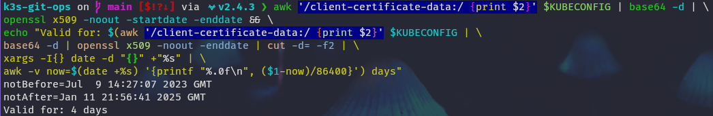

# Installation

## Requirements

- git
- ansible
- kubectl
- helm

## Preparation

- Clone this repository

```shell
git clone https://github.com/madic-creates/k3s-git-ops
```

- Configure [pre-commit-hooks](pre-commit-hooks.md)
- Adapt ansible vars to your needs. The default variables are located in `ansible/group_vars/all/main.yaml`. You can override them by creating environment-specific variable files in `ansible/group_vars/production/` or `ansible/group_vars/staging/`.

For example, to set the VIP for your production environment, create `ansible/group_vars/production/main.yaml` with the following content:
```yaml
k3s_vip: "192.168.1.230"
```

- Install required ansible modules

```shell
ansible-galaxy collection install -r requirements.yaml
```

### Ansible inventory

The inventory is now structured by environment (e.g., `production`, `staging`) inside the `ansible/inventory/` directory. This playbook requires the following host groups:

- `k3s_primary_server`: The first server node that initializes the cluster.
- `k3s_secondary_server`: Additional server nodes to join the cluster for HA.
- `k3s_agent`: The agent/worker nodes.

Example for `ansible/inventory/production/hosts`:

```ini
[k3s_primary_server]
node01.example.com

[k3s_secondary_server]
node02.example.com
node03.example.com

[k3s_agent]
agent01.example.com
```

## Installation

Run ansible from within the ansible folder. Specify the inventory for your target environment.

```shell
cd ansible
ansible-playbook playbooks/install.yaml -i inventory/production/hosts --diff
```

Ansible downloads the kubeconfig file to the folder **./shared/${HOSTNAME}/k3s.yaml** file. You can use this file to access the cluster.

To get the validity of the kubeconfig file, you can use the following command (either replace **$KUBECONFIG** with the path to the kubeconfig file or set it as environment variable):

```shell
awk '/client-certificate-data:/ {print $2}' $KUBECONFIG | base64 -d | \
openssl x509 -noout -startdate -enddate && \
echo "Valid for: $(awk '/client-certificate-data:/ {print $2}' $KUBECONFIG | \
base64 -d | openssl x509 -noout -enddate | cut -d= -f2 | \
xargs -I{} date -d "{}" +"%s" | \
awk -v now=$(date +%s) '{printf "%.0f\n", ($1-now)/86400}') days"
```

[{: loading=lazy}](images/kubeconfig_validity.png)

## Removal

```shell
cd ansible
ansible-playbook playbooks/remove.yaml -i inventory/production/hosts -l node01.example.com -K --diff
```

## ArgoCD

```shell
kubectl kustomize apps/argo-cd --enable-helm | kubectl apply -f -
kubectl kustomize apps/overlays/vagrant | kubectl apply -f -
```

Get the ArgoCD Login password for the admin user:

```shell
kubectl get secret argocd-initial-admin-secret -n argocd -o jsonpath="{.data.password}" | base64 -d
```

Remove ArgoCD

```shell
kubectl kustomize bootstrap --enable-helm | kubectl delete -f -
```
